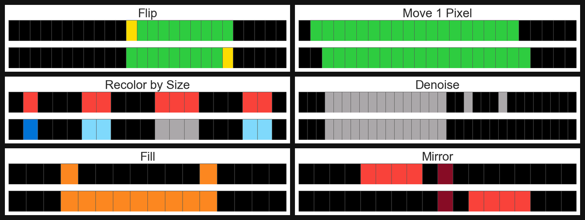
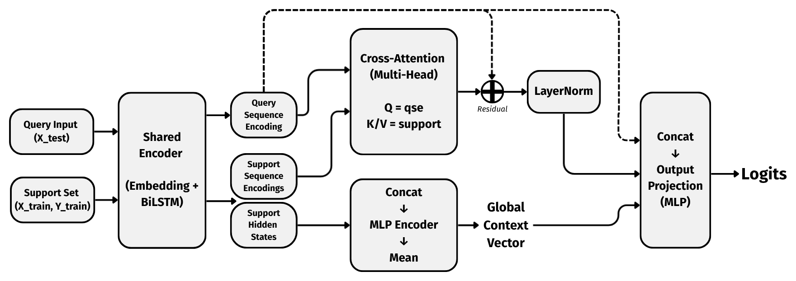
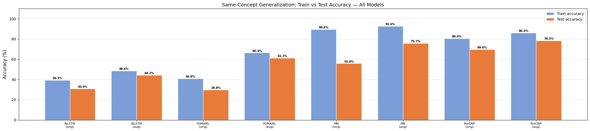
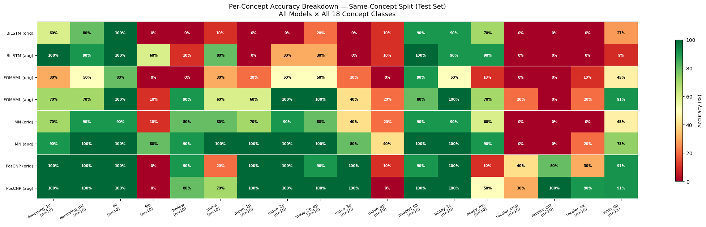
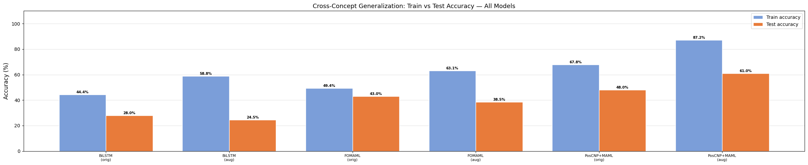
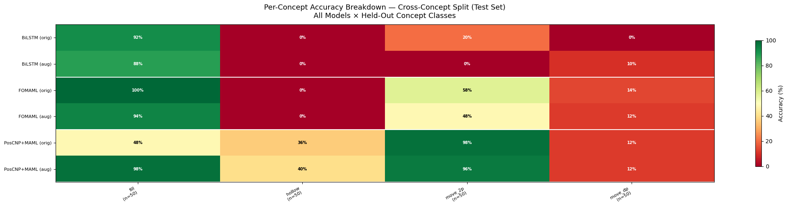

# 1D-ARC — Few-Shot Sequence Transformation

> Built as part of the Meta-Learning course at IIIT Delhi.

Given 2–4 input/output sequence pairs, infer the transformation rule and apply it to a new input — treated as a meta-learning problem across 901 tasks and 18 concept classes (recolor, flip, move, fill, denoise, mirror...).

Dataset: [khalil-research/1D-ARC](https://github.com/khalil-research/1D-ARC)

---

## Dataset

Each row below shows an input→output pair for a concept class. The model sees 2–4 such pairs as a support set and must predict the output for a new input.



---

## Models

| Model | Training | Key Idea |
|---|---|---|
| BiLSTM Baseline | Supervised | Encodes support pairs independently |
| BiLSTM + FOMAML | MAML | Learns an init that adapts at test time |
| Matching Networks | Episodic | Attends over support embeddings |
| **PosCNP** | MAML | Multi-head cross-attention from query onto support — preserves positional structure |

All MAML models run 20 gradient steps on the support set at test time before predicting.

### PosCNP Architecture



---

## Results

Two settings: **same-concept** (test tasks share concept classes with training) and **cross-concept** (entire concept classes withheld — model must generalize to unseen transformation types).

### Same-Concept





### Cross-Concept





**Best:** PosCNP + MAML + augmentation → **79% same-concept, 61% cross-concept**

---

## Structure

```
arc_meta_learning.ipynb   ← models, training, evaluation
report.pdf
presentation.pdf
data/                     ← 1D-ARC dataset (JSON tasks + visualisation utils)
models/
  sc/                     ← same-concept weights (bilstm, fomaml, poscnp × orig/aug)
  cc/                     ← cross-concept weights
assets/                   ← result charts
```

---

## Setup

```bash
pip install torch numpy
jupyter notebook arc_meta_learning.ipynb
```
